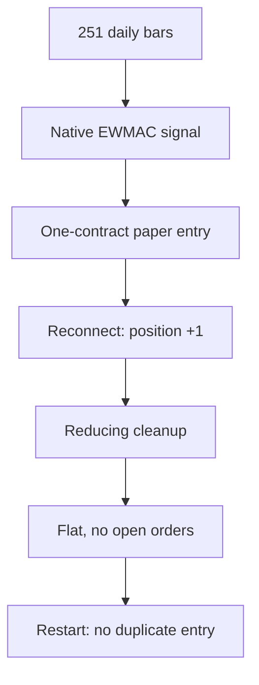

# Autonomous trading research

An automated trading research and execution-validation system built around existing trading engines. The project evaluates public performance claims, tests failure handling offline, and integrates native strategy calculations with guarded IBKR paper execution.

The execution pipeline generates native EWMAC signals, journals order intent, enforces account and exposure limits, reconnects to verify positions, and returns to flat. A bounded batch coordinator repeats that lifecycle and checks durable duplicate prevention in a fresh process after every cycle. See [the latest execution-validation findings](BATCH_RESULTS.md).

Latest milestone: **10 additional paper round trips, 20 fills, 10 duplicate checks with zero new orders, and 28 passing offline tests.** Gross simulated batch P&L was **-USD 13.75**; fees and net P&L are unknown. The account finished flat with entry disabled.

## Start here

| Interest | Read or run |
|---|---|
| See the result without installing anything | `python3 demo.py` |
| Research and evidence standards | [Research](RESEARCH.md), [source ledger](SOURCE_LEDGER.md), [code catalog](CODE_CATALOG.md) |
| What was built and why | [PRD](PRD.md), [architecture](ARCHITECTURE.md) |
| Reproduce the offline checks | [Setup and validation](REPRODUCE.md) |
| Understand the broker exercise and stop controls | [Operations](OPERATIONS.md) |
| Understand the earlier harness correction | [Offline validation](OFFLINE_VALIDATION.md) |
| Latest batch methodology and findings | [Execution validation](BATCH_RESULTS.md), [sanitized batch evidence](batch-evidence.json) |
| Costs and remaining gaps | [Results and limitations](RESULTS.md) |
| Scope, provenance and attribution | [Project scope](SCOPE.md), [third-party notices](NOTICE.md) |

## Execution lifecycle



| Input or check | Observed result |
|---|---|
| Native combined forecast | 6.758358 |
| Uncapped target | 0.796989 MES contracts |
| Test cap | One contract |
| Simulated entry / exit | 7682.25 / 7682.00 |
| Gross simulated P&L | -USD 1.25 |
| Fees / net P&L | Unknown |
| Final positions / open orders | Zero / zero |

The diagram describes the execution lifecycle. The table preserves the initial September 8, 2026 paper round trip, preceding the [additional ten-cycle batch](BATCH_RESULTS.md). [Sanitized evidence](paper-evidence.json) contains the retained fields. It is neither a fictional trading result nor a live-money result. Raw broker identifiers and market history are excluded.

## Run the safe walkthrough

```sh
python3 demo.py
```

This dependency-free command checks the saved arithmetic and flat-state evidence. It does not regenerate the broker exercise, estimate returns, open a network connection, or place an order.

For the full offline guard tests, use Python 3.12 and the [pinned setup](REPRODUCE.md). The suite contains 28 tests covering account and endpoint isolation, order scope, stop behavior, duplicate intent consumption, restart claims, native storage, invalid data, cycle isolation, batch bounds and fail-closed batch termination. Fixtures are explicitly synthetic and require no brokerage account.

## What the code includes

The repository contains the original Passivbot offline harness correction as a patch, a guarded native pysystemtrade connection patch, the paper execution coordinator and batch runner, data acquisition and signal adapters, configuration tooling, tests and research records. Bootstrap fetches exact upstream commits rather than redistributing large clones or compiled runtimes.

Paper execution requires deliberate local configuration and an explicit command. The shipped template is disabled, has no account allowlist, and creates a STOP marker. The tested runtime was left flat with Gateway read-only restored. No scheduler is included.

## Limits and authorship

Delayed quotes and IBKR continuous history make the paper exercise an integration variant. It does not reproduce a full production roll pipeline or validate a historical strategy. Abrupt failure during an uncertain order submission and Gateway restart recovery remain unproven. Live margin and futures access were unavailable in the source environment; private eligibility information is omitted.

The work used AI assistance for research synthesis, implementation, documentation and testing. Upstream authors created the underlying trading engines. The project contribution is the bounded evaluation, harness correction, safety coordination and evidence record. [Provenance and licenses](NOTICE.md) distinguish those contributions.
