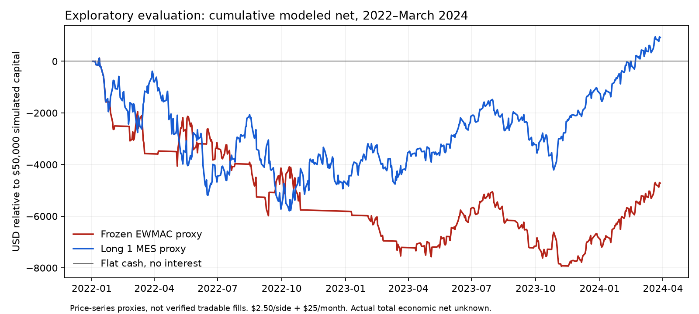

# Frozen EWMAC evaluation: negative result

The candidate fails this exploratory economic screen. In the frozen 2022–March2024 evaluation period it lost $3,935 before modeled costs and $4,720 after the base cost scenario. It also underperformed both the long-one-contract proxy and flat cash. Keep order execution disabled; do not tune this candidate on the opened evaluation data.



These are adjusted-price-series proxies from pinned upstream example data, not verified tradable MES returns, actual paper profit or evidence of dependable live performance. The previous11 forced round trips remain execution tests and are excluded here.

## Frozen design and results

[Protocol](VALIDATION_PROTOCOL.md) was committed as `dae0abf` before return calculation. Native pinned simplesystem EWMAC8/32 and32/128, scalars5.3/2.65, equal weights, diversification multipliers1, forecast cap20, USD50,000 fixed simulated capital,10% volatility target and max1MES. No parameter search. After200 observed warmup sessions, signals are installed two observed sessions later at close and only earn subsequent changes. True target0 exits; reversals close/reopen; unchanged targets hold. A terminal liquidation is separately counted as a measurement boundary.

Base costs: $2.50 per contract side including estimated commission, exchange/regulatory charges and spread/slippage, plus $25 per calendar month for allocated infrastructure/data/tools. Roll proxy charges two sides per exposed observed contract change. Current official low-volume IBKR micro commission is $0.25/side plus exchange/regulatory charges; the CME fee table lists $0.35 for MES before applicable additional charges. Neither number establishes actual all-in fill cost. Fees are not inferred to be zero when the broker omits them.

| Period | Dates | Daily observations | Gross proxy | Modeled net | Maximum dollar drawdown | Completed rule episodes |
|---|---|---:|---:|---:|---:|---:|
| development | 2020-02-10 to 2021-12-31 | 485 | $5,086 | $4,438 | $3,539 | 7 |
| frozen evaluation | 2022-01-03 to 2024-03-28 | 562 | $-3,935 | $-4,720 | $8,058 | 17 |
| all post warmup | 2020-02-10 to 2024-03-28 | 1047 | $803 | $-626 | $8,396 | 24 |

Each partition starts flat; combined-period results are therefore not the sum of separately started partitions. The evaluation covers562 sessions and2.23 calendar years. EWMAC exposure was64.2% of sessions versus99.5% for the long1MES benchmark. Evaluation had35 target changes,17 completed directional episodes,36 trade sides including one final boundary liquidation, and10 roll-cost sides. These are few independent episodes, not hundreds of independent trades.

Base evaluation comparisons: EWMAC modeled net −$4,720; long1MES +$921; flat cash $0 with no interest/cost assumption. Long1MES is a transparent exposure benchmark, not matched-volatility allocation. EWMAC maximum drawdown was $8,058 (16.1% of initial capital), versus $5,914 for long1MES. EWMAC daily-return annualized volatility was5.96%; simple annualized return was−4.23%. No risk tolerance or acceptable drawdown was inferred for the user.

All nine frozen execution/infrastructure cost scenarios were negative in the evaluation: modeled net ranged from −$4,004 to −$6,846. One extra execution-delay session also lost money: base modeled net−$3,833. No best setting was selected. The positive development result did not persist in evaluation. All-post-warmup base net was−$626. Exact cumulative real economic net remains unknown because actual fees, data/hosting/tool/startup allocations and executable fills are not established. No cash interest is credited; USD base; taxes excluded.

## Data audit and limits

The pinned MES-labelled adjusted/multiple files contain35,898 records starting1982, although MES launched May6,2019. We excluded20,149 pre-launch records, including warmup. The remainder produced1,247 observed daily rows through March28,2024, less than five post-launch years on one instrument. Post-launch product/contract price provenance is not independently confirmed. Upstream documentation explicitly says shipped CSVs are stale since March2024. The separate roll-calendar file ends May2022; multiple-price contract labels continue later. Twenty contract-label changes were observed, but this does not establish a prospective executable roll policy.

Adjusted-price changes differ from raw-front changes by as much as61.75 index points, demonstrating why raw contract switches cannot simply be treated as returns. The evaluation uses adjusted differences plus an explicit roll-cost proxy; it does not reconstruct both tradable roll legs or prove point-in-time settlement availability. Native forecast prefix checks passed at250,500 and800 observations, ruling out a coding lookahead in those prefixes, not historical revision/roll-selection bias in the source data.

A verified tradable backtest still requires independently sourced individual-contract vintages, actual expiry calendars, both roll-leg prices, a predeclared roll rule and matching executable timestamps. IBKR normally limits expired futures history to two years after expiration; it is not a solution for unlimited older contract history. The current Gateway was unavailable, so no fresh historical contract retrieval could be verified. Existing one-year normalized IB history is separately labeled an integration variant and is not substituted into this historical performance series.

## Verification and forward boundary

37 tests passed:28 existing safeguards plus9 new accounting/recovery tests. New tests independently check delayed P&L by hand, short direction, roll/boundary costs, drawdown, cost monotonicity, durable pending-send restart, ambiguous no-evidence blocks, partial fills, execution deduplication, stale/open/incomplete/mismatched evidence, same-date revision and HOLD/reversal behavior. Synthetic partial fills test the recovery component; they are not observed broker partial fills. There is no active forward writer.

The shadow recorder successfully saved one cached September8 observation (delayed September3 target+1), and a second process recognized it as a duplicate. It sent zero orders. This is not a new forward market observation. A close-time/date-label mismatch was caught and corrected before recording; stale/unfinished data remains blocked. Current broker state is unverified because localhost4002 was unavailable. Prior STOP marker remains present. No scheduler, lease, account change, funding or real trade occurred.

[Forward workflow and finite operating plan](FORWARD_RESEARCH.md) records the concrete remaining dependency. The negative candidate should remain in shadow research. Any replacement needs a new hypothesis/version and evaluation discipline, not optimization against this opened period.

## Reproduce

Use the repository's pinned Python3.12 environment and upstream bootstrap. Set `PAPER_PROJECT_HOME` to a private runtime location outside the repository.

```bash
python evaluate_strategy.py --upstream "$PAPER_PROJECT_HOME/upstream/pysystemtrade" --out "$PAPER_PROJECT_HOME/evaluation"
python -m unittest test_guards test_operation test_batch test_validation -v
python forward_plan.py --history /absolute/path/continuous-history.parquet --out "$PAPER_PROJECT_HOME/forward"
python capture_paper_state.py --private-dir "$PAPER_PROJECT_HOME/private" --out "$PAPER_PROJECT_HOME/paper-state.json"
```

The evaluator needs no broker connection. Summary results and source/protocol hashes are in [validation-evidence.json](validation-evidence.json); raw price data, private broker configuration and SQLite state are excluded from publication.

Sources checked September9,2026: [pinned native example](https://github.com/pst-group/pysystemtrade/blob/b4a25e6e1e33a54a3ecfb45c0f6db5e2b60b84f8/systems/provided/example/simplesystemconfig.yaml), [upstream data limitations](https://github.com/pst-group/pysystemtrade/blob/b4a25e6e1e33a54a3ecfb45c0f6db5e2b60b84f8/docs/data.md#note-on-outdated-shipped-csv-data), [CME launch](https://www.cmegroup.com/media-room/press-releases/2019/5/06/cme_group_announceslaunchofnewmicroe-miniequityindexfutures.html), [IBKR commissions](https://www.interactivebrokers.com/en/pricing/commissions-futures.php), [CME charges via IBKR](https://www.interactivebrokers.com/en/accounts/fees/CME.php), [IB historical limitations](https://interactivebrokers.github.io/tws-api/historical_limitations.html), [settlement timing](https://interactivebrokers.github.io/tws-api/historical_bars.html).
